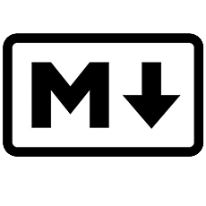

# ¿Qué es Markdown y cuáles son sus ventajas?

Markdown es un lenguaje de marcado que surge con la meta de poder escribir documentos virtuales y la posibilidad de dar formato a sus textos, a la vez que, mantiene una forma fácilmente legible e interpretable para el escritor.

Y es que, al no utilizar un sistema de etiquetas como otros lenguajes de marcado, Markdown, nos permite a los que lo utilizamos estructurar de una forma más clara los elementos del documento, de manera que podemos acceder al contenido de forma más fácil y rápida.

Pero eso no es todo, la sintaxis básica de este lenguaje, lo cual comprende el 95% de su uso habitual, es extremadamente fácil de aprender por lo que nos permite ponerlo en práctica en menos de media hora y, además, evitamos la engorrosa tarea de andar abriendo y cerrando etiquetas continuamente.

EH! Espera no te muevas, todavía hay más.

## ¿Por qué usar Markdown?

Dejando a un lado lo mencionado anteriormente cuando hablamos de Markdown estamos hablando de uno de los formatos más universales de todo internet, la compatibilidad de Markdown facilita su edición y publicación en diferentes plataformas, servicios y aplicaciones, manteniendo el formato origen del documento sin complicaciones.

Por eso, si publicamos con asiduidad en internet nos interesará saber que servicios como Trello y Github, plugins de CMS para Wordpress o Joomla y foros como Reddit y Stackoverflow estan preparados para la compatibilidad con Markdown. No solo eso, también podemos utilizarlo para redactar emails con formato o escribir en una web sin tener ni idea de HTML.

>Por cierto, podrás ver este mismo artículo hecho con Markdown en el readme.md de un repositorio subido a mi Github que he subido para que puedas verlo desde otra plataforma, pinchando [aquí](https://github.com/anunde/markdown).

No obstante, el propio inventor de Markdown, [John Gruber](https://en.wikipedia.org/wiki/John_Gruber), ha desarrollado una herramienta online [Dingus](https://daringfireball.net/projects/markdown/dingus) que nos permite convertir nuestro documento Markdown a HTML si fuera necesario. Y no solo a HTML, hay decenas de formas a través de las cuales podemos exportarlo fácilmente a .pdf, .doc e incluso .epub si quisiéramos escribir un libro con él.

Entonces no es de extrañar que debido a su gran compatibilidad y a su empinada curva de aprendizaje sea elegido por equipos de trabajo que comprendan una variada plantilla formada por profesionales especializados en diferentes disciplinas. Una inteligente forma de unir periodistas y redactores con programadores y diseñadores.

## Sintaxis básica: Énfasis

Soy un `*texto inclinado*`. - Soy un *texto inclinado*.   
Soy un `**texto en negrita**`. - Soy un **texto en negrita**.   

>En Markdown no se puede utilizar el **underline**

## Sintaxis básica: Links

Soy un `[enlace](https://anundeweb.com/)` a esta web. - Soy un [enlace](https://anundeweb.com//) a esta web.

## Sintaxis básica: Imágenes

``  

## Sintaxis básica: Headers

    # Header 1    
    ## Header 2  
    ### Header 3   
    #### Header 4   
    ##### Header 5    
    ###### Header 6

